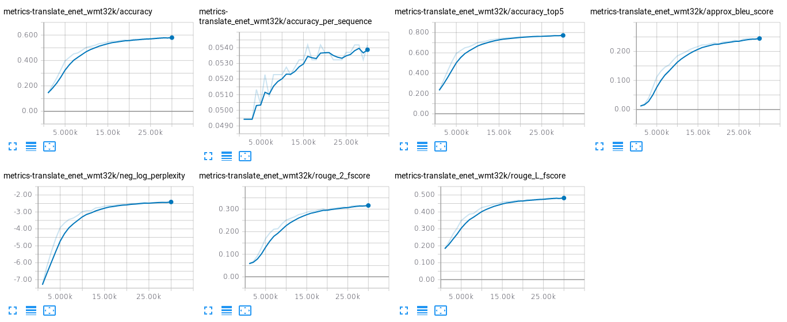

# Neural Machine Translation system for English to Estonian

This repository contains all data and documentation for building a neural
machine translation system for English to Estonian.

# Dataset

The *WMT18 English-Estonian* data comes from [EMNLP 2018 website](http://www.statmt.org/wmt18/translation-task.html).

## Training

The original training data from WMT18 is used. The training data for English-Estonian is the following:

| Data set         | Sentences | Download
| ---------------- | --------- | ---------------------------------------------------------------------------------------------------------------------------
| Europarl v8      |   652,944 | [WMT18](http://data.statmt.org/wmt18/translation-task/training-parallel-ep-v8.tgz)
| ParaCrawl corpus | 1,298,103 | [WMT18](https://s3.amazonaws.com/web-language-models/paracrawl/release1/paracrawl-release1.en-et.zipporah0-dedup-clean.tgz)
| Rapid corpus     |   226,978 | [WMT18](http://data.statmt.org/wmt18/translation-task/rapid2016.tgz)

## Development

For development data, the SGML tags needs to be stripped. For this purpose, the
`input-from-sgm.perl` script from [Moses](https://github.com/moses-smt/mosesdecoder/blob/master/scripts/ems/support/input-from-sgm.perl)
was used. The resulting development set was uploaded to this GitHub repository.

| Data set         | Sentences | Download
| ---------------- | --------- | --------------------------------------------------------------------------------------------
| Development      | 2,000     | via [GitHub](https://github.com/stefan-it/nmt-en-et/raw/master/data/newsdev2018-enet.tar.gz)

## Summary

Here comes a summary of training and development set:

| Data set         | Sentences
| ---------------- | ---------
| Training (all)   | 2,178,025
| Development      |     2,000

# *fairseq*

The first NMT system for English to Estonian is built with [*fairseq*](https://github.com/facebookresearch/fairseq).
We trained one system with fully convolutional encoder & decoder.

## Preparation

### Training data

Download the training corpora:

```bash
wget "http://data.statmt.org/wmt18/translation-task/training-parallel-ep-v8.tgz"
wget "https://s3.amazonaws.com/web-language-models/paracrawl/release1/paracrawl-release1.en-et.zipporah0-dedup-clean.tgz"
wget "http://data.statmt.org/wmt18/translation-task/rapid2016.tgz"
```

Extract them:

```bash
tar -xzf paracrawl-release1.en-et.zipporah0-dedup-clean.tgz
tar -xzf rapid2016.tgz
tar -xzf training-parallel-ep-v8.tgz
```

Combine the training corpora for each source and target language to one corpus:

```bash
cat paracrawl-release1.en-et.zipporah0-dedup-clean.en rapid2016.en-et.en \
    training/europarl-v8.et-en.en > training.en

cat paracrawl-release1.en-et.zipporah0-dedup-clean.et rapid2016.en-et.et \
    training/europarl-v8.et-en.et > training.et
```

Then the `data_preparation.sh` script tokenizes and applies bpe to the training
corpus:

```bash
cd scripts
./data_preparation.sh ../training.en ../training.et
cd ..
```

Finally, the folder structure for `fairseq-py` for the training corpus needs to
be created:

```bash
mkdir train
cp scripts/corpus.clean.bpe.32000.en train/train.en
cp scripts/corpus.clean.bpe.32000.et train/train.et
```

### Development data

The development data needs to be extracted first:

```bash
cp data/newsdev2018-enet.tar.gz .
tar -xzf newsdev2018-enet.tar.gz
```

Then the development data can also be tokenized and preprocessed:

```bash
cd scripts
rm -f bpe.32000 corpus.* vocab.*
./data_preparation.sh ../newsdev2018-enet-src.en ../newsdev2018-enet-ref.et
cd ..
```

Finally, the folder structure for `fairseq-py` for the development data needs
to be created:

```bash
mkdir dev
cp scripts/corpus.bpe.32000.en dev/dev.en
cp scripts/corpus.bpe.32000.et dev/dev.et
```

## Training

## Decoding

## Calculating the BLEU-score

## Results

# *tensor2tensor* - Transformer

Another NMT system for English-Estonian is built with the [*tensor2tensor*](https://github.com/tensorflow/tensor2tensor)
library.

## Results

### Model A

Model A is trained on a *DGX-1* with 8 NVIDIA P100 GPUs for 30.000 steps.

The *TensorBoard* figure shows some nice statistics:



The obtained BLEU-scores on the development set for this models are:

| Model | BLEU-score
| ----- | ----------
| A     | 16.32 (uncased)
| A     | 15.98 (cased)

# Acknowledgments

We would like to thank the *Leibniz-Rechenzentrum der Bayerischen Akademie der
Wissenschaften* ([LRZ](https://www.lrz.de/english/)) for giving us access to the
NVIDIA *DGX-1* supercomputer.
